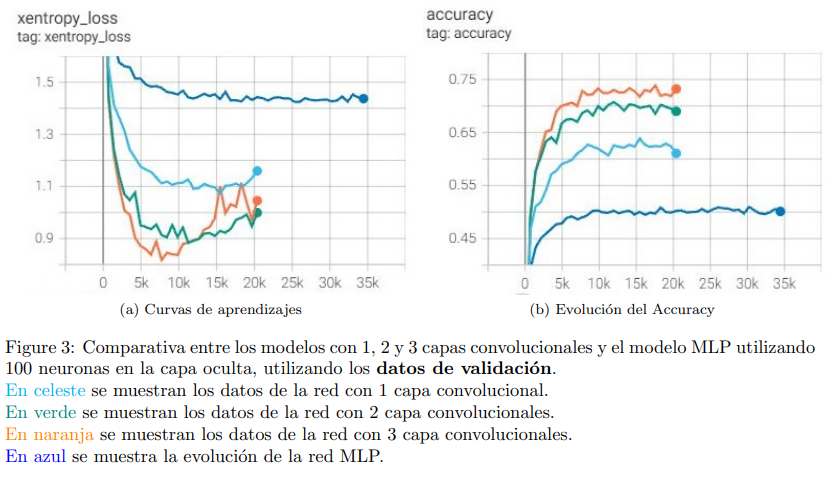
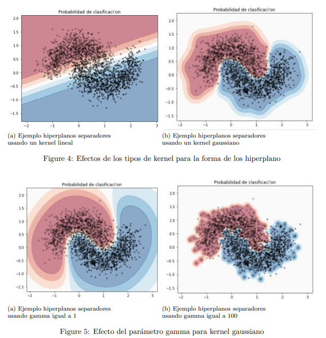
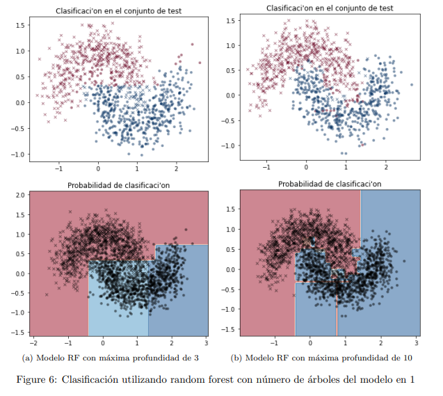

# Inteligencia-Computacional
Repositorio de tareas y actividades del curso EL4106 Inteligencia Computacional Primavera 2021, Universidad de Chile. 

Profesor: Pablo Estevez V.
Auxiliar: Ignacio Reyes J.
 
Dentro del curso se desarrollaron Actividades, Tareas con partes teóricas y partes experimentales y un Proyecto final el cual corresponde a una clasificación supervisada de SuperNovas y tiene su propio [repositorio](https://github.com/joaquinzepeda/Proyecto-ClasificacionSN) (aunque el readme no está actualizado). 
 
Las librerías más utilizadas en el desarrollo del curso son:
* Numpy
* Matplotlib
* Sklearn
* Pandas
* **Tensorflow**

## Actividades
 
### Actividad 1 
* Álgebra Lineal: Repaso de conceptos básicos de álgebra lineal. 
* Probabilidades y estadística: Repaso de conceptos básicos de Probabilidades y estadística.
* Programación: Repaso de conceptos básicos, programación orientada a objetos, uso de librerías como *Numpy* y *Matplotlib*.
 
### Actividad 2 
* Matemáticas: Repaso de operaciones útiles.
  1. Valores y vectores propios
  2. Geometría
* Biología: Concepto de selección natural. 
* Programación: Uso de tensorflow para modelar la curva de luz de una estrella. 
 
### Actividad 3
* Repaso de la regla de aprendizaje por gradiente descendiente para un modelo simple.
* Programación sin el uso de tensorflow para clasificar utilizando la regla anterior dos conjuntos de datos aleatorios. 
 
### Actividad 4
* Algoritmo de backpropagation desarrollado a mano en un modelo simple.
 
## Tareas
Todas las tareas tienen 2 secciones, una parte teórica y una parte práctica/experimental, los resultados y análisis correspondientes de ambas secciones se unen en un informe el cual recopila todo de forma resumida.  
 
### Tarea 1: Multilayer perceptron o perceptrón multicapa (MLP)
* Parte teórica: Resolución de preguntas conceptuales acerca de esta red MLP, ventajas, desventajas y características. 
* Parte práctica: Realización de un clasificador de digitos manuscritos usando redes neuronales MLP, usando como conjunto de entrenamiento la base de datos MNIST. Luego de generado el clasificador se desarrollan experimentos.
 
### Tarea 2: Redes Neuronales Convolucionales (CNN)
* Parte teórica: Cálculo de parámetros de la red VGGNet. 
* Parte práctica: Clasificación de imágenes utilizando la base de datos CIFAR-10, la cual contiene 60000 imágenes de 32x32 a color, 50000 de entrenamiento y 10000 de prueba, 10 clases de imágenes con cada clase balanceada. Luego experimentos con respecto a esta. 

 

 
### Tarea 3: SVM y Random Forest
Support Vector Machine o Máquinas de soporte vectorial y Random forest son técnicas de aprendizaje supervisado que tienen muy buenos resultados para problemas de clasificación (aunque también se pueden usar para problemas de regresión).
 
* Parte teórica: Repaso de conceptos sobre estas técnicas. 
* Parte práctica: Resolución de 2 problemas de clasificación binaria utilizando los conjuntos de datos "Two moons" y "Covertype dataset" utilizando SVM y Random forest respectivamente para cada conjunto.

 

### Tarea 4: Aprendizaje NO supervisado
Exploración de la base de datos de las exportaciones de cada país a partir de los datos del Observatorio de Complejidad Económica del MIT, utilizando algoritmos de aprendizaje no supervisado: PCA, Kernel-PCA, Mapas auto-organizativo de Kohonen (SOM).

## Proyecto: Clasificación de Supernovas

Integrantes : Joaquin Zepeda, Benjamin Irarrazabal  
Tutor : Pablo Montero   
### Descripción del proyecto
En este proyecto se busca clasificar, de forma supervisada, series de tiempo astronómicas de supernovas. Estas series en astronomía son conocidas como curvas de luz, las cuáles entregan información sobre el brillo estelar, su error y el día en que ocurrió. Dicha información será extraída de la base de datos provista por el equipo del Automatic Learning for the Rapid Classification of Events (ALeRCE) el cuál es un broker de alertas astronómicas que recibe y procesa observaciones provenientes del survey astronómico Zwicky Transient Facility (ZTF). La base de datos está compuesta por cerca de 2000 curvas de luz de supernovas (correspondientes a SNIa, SNIbc, SNII, SNIIb, SNIIn, SNSL) y posee un alto desbalance entre la cantidad de curvas de luz de cada clase.
 
En primera instancia se inspeccionan, visualizan y procesan los datos para luego extraer las características de cada curva de luz. Una vez teniendo las características deberán trabajarlas y proponer un modelo supervisado que permita clasificarlas según su determinada clase. Para cumplir con lo anterior, propongan una estrategia para entrenar y evaluar el desempeño bajo un contexto de desbalance. Finalmente deberán estudiar la relevancia que tiene cada característica en la clasificación final. 
Con respecto a las variantes, deberán estudiar 3 algoritmos de clasificación donde al menos 1 debe ser distinto al del otro grupo. El algoritmo que escojan deberá ser estudiado a cabalidad, además deberán investigar e implementar técnicas de proyección/reducción de dimensionalidad de los vectores de características y lidiar con el desbalance de las clases.

Se utilizó Random Forest, red neuronal MLP y KNN, pero por temas de tiempo se le dio enfoque a estos 2 primeros. Además se realizó una clasificación binaria y una clasificación Multiclase, siendo la clasificación binaria la clasificación de supernovas SNIa vs No SNIa.

### Software and Libraries
   Opción 1: Usar el entorno gratuito de Google Colab  
   Opción 2: Python 3.6 Jupyter notebook   
   scikit-learn      0.24.2  
   imbalanced-learn  0.8.1  
   pandas            1.3.2  
   tensorflow        2.3.0  

